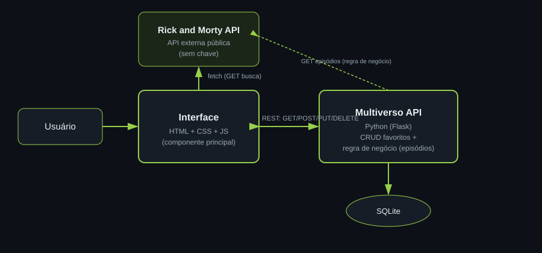

# Explorador do Multiverso — Interface (componente principal)

Busque personagens de Rick and Morty e monte a sua lista pessoal de favoritos, com notas e consulta aos 
episódios em que cada um apareceu.
Este repositório contém o **componente principal (Interface)** do MVP de componentização. Ele se comunica 
com dois outros serviços:
1. **Rick and Morty API** (`https://rickandmortyapi.com`) — API externa pública, consumida diretamente 
pelo navegador para buscar nome, imagem, status e espécie de um personagem.
2. **[multiverso-api](../multiverso-api)** — API própria (Flask), que guarda os favoritos e traz os 
episódios de cada personagem.

## Arquitetura



- A Interface faz `fetch` para `GET /api/character/?name=...` na Rick and Morty API e trata o JSON
 retornado na própria página (nenhum redirecionamento acontece). Ao clicar em "Favoritar", a Interface 
 envia os dados para a `multiverso-api` via `POST`.
- A lista de favoritos (com filtro por status/espécie, ordenação, paginação e edição/remoção) é lida e 
alterada via `GET`, `PUT` e `DELETE` na mesma API.
- Ao clicar em "Ver episódios" num favorito, a Interface chama `GET /api/favoritos/{id}/episodios` na
`multiverso-api`, que por sua vez consulta a Rick and Morty API no servidor (regra de negócio).

## API externa utilizada

- **Nome**: Rick and Morty API
- **Licença/uso**: pública, gratuita, sem necessidade de cadastro ou
  chave (licença BSD)
- **Rotas usadas**: `GET /api/character/?name={nome}` (busca) e, no back-end, `GET /api/character/{id}` 
+ `GET /api/episode/{ids}` (regra de negócio de episódios)
- **Documentação**: https://rickandmortyapi.com/documentation

## Como rodar

### Opção 1 — Docker (recomendado)

```bash
docker build -t multiverso-frontend .
docker run -p 8080:80 multiverso-frontend
```

Acesse http://localhost:8080

### Opção 2 — Localmente, sem Docker

```bash
python3 -m http.server 8080
```

> A `multiverso-api` deve estar rodando em `http://localhost:5000` para
> os favoritos funcionarem. Se a API estiver em outro endereço, defina
> antes de carregar `script.js`:
> `<script>window.MULTIVERSO_API_URL = "http://minha-api:5000/api";</script>`

## Estrutura

```
multiverso-frontend/
├── index.html
├── style.css
├── script.js
├── arquitetura.svg
└── Dockerfile
```

## Funcionalidades extras

- Filtro por status e por espécie, ordenação (recentes / nome / status) e paginação na lista de favoritos.
- Regra de negócio: busca dos episódios em que o personagem favoritado aparece, encadeando duas chamadas 
na API externa a partir do back-end.
- Autenticação por chave de API (`X-API-Key`) nas rotas de escrita da API própria — a Interface já envia 
a chave automaticamente.
- Gráfico donut (SVG puro, sem dependência externa) mostrando a distribuição dos favoritos por status.
- Notificações toast para as ações de favoritar, editar e remover, no lugar de um texto de status simples.
- Edição de notas em um favorito já salvo, via modal.
